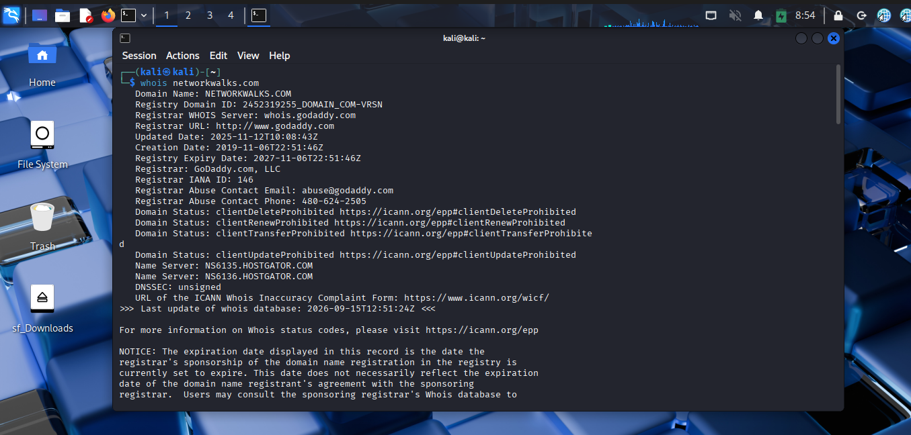
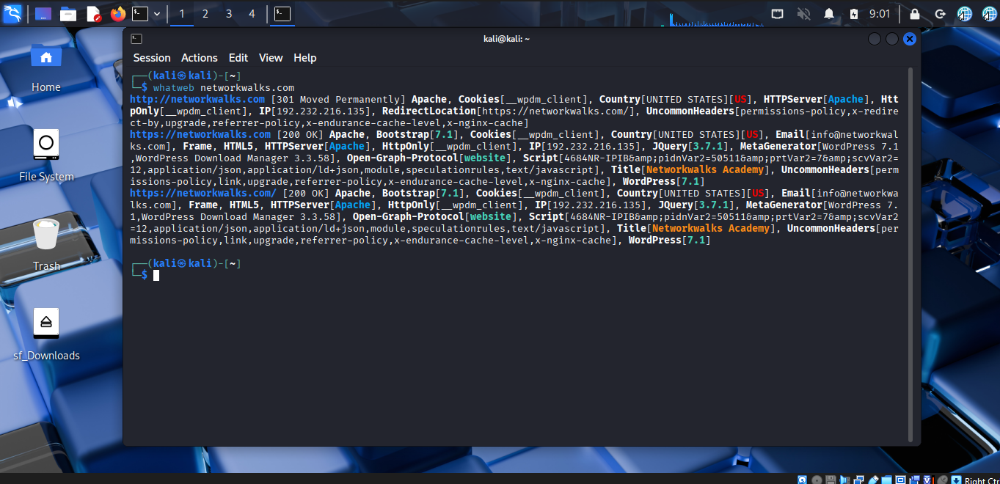
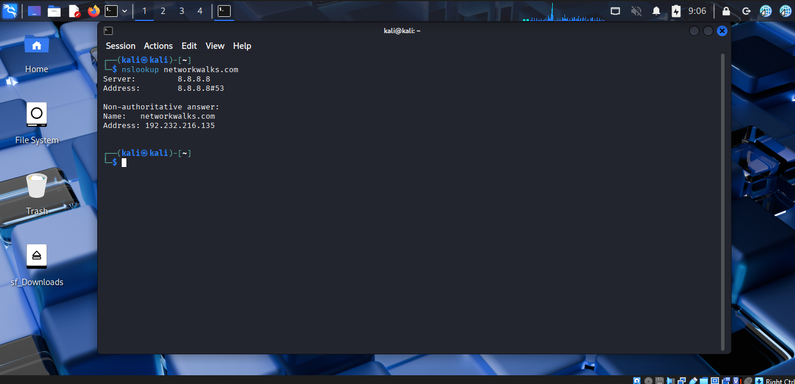
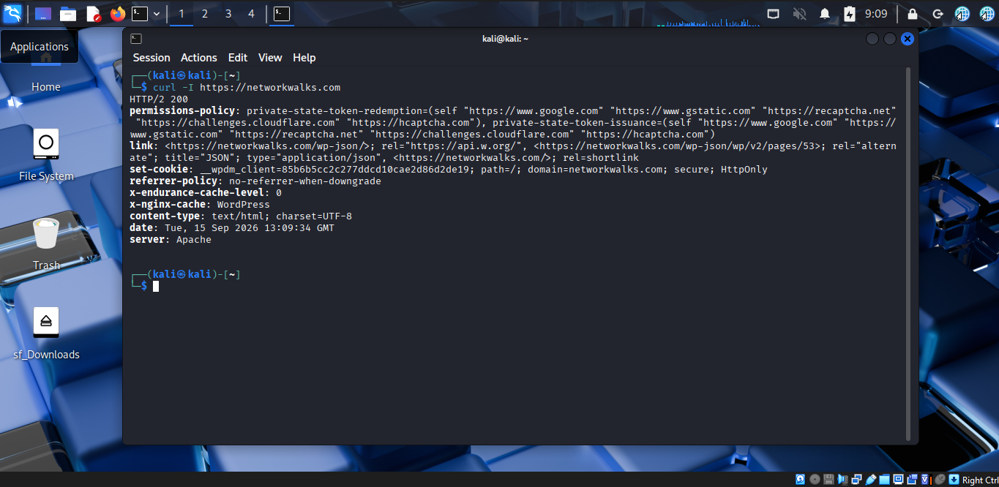
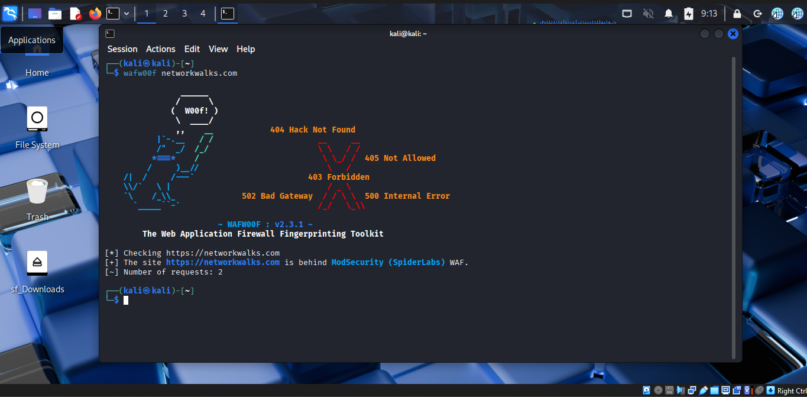
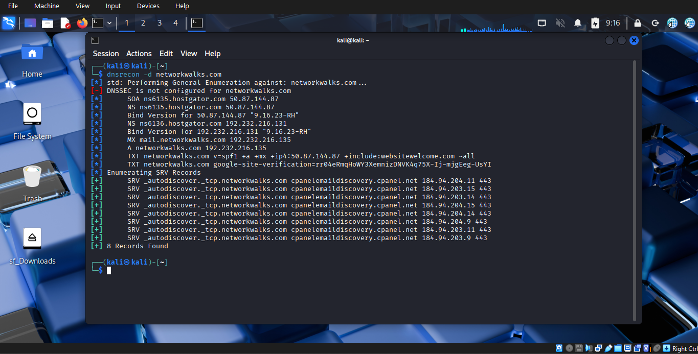
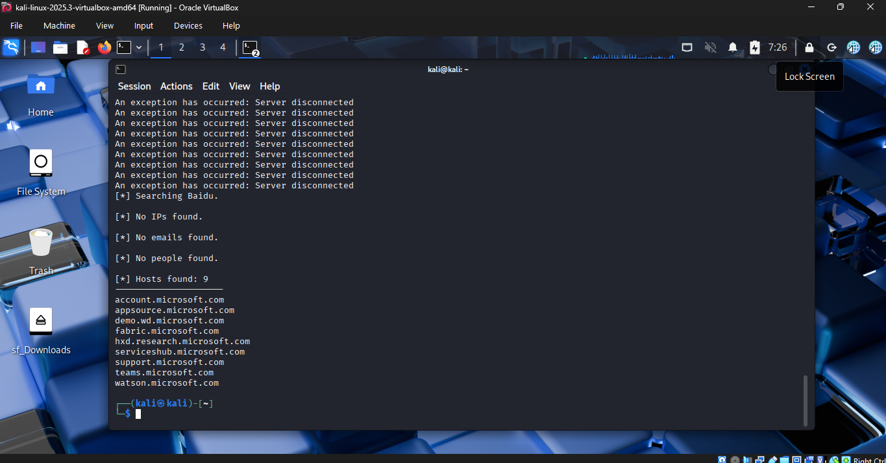
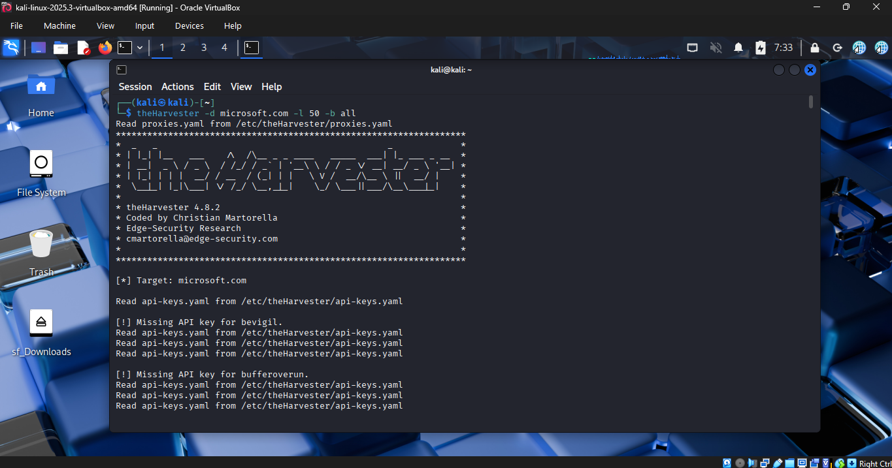

# 🛡️ NetworkWalks Cybersecurity Internship – Week 2

This repository documents my **Week 2 practical tasks** completed during my Cybersecurity Internship at **NetworkWalks**.

The activities covered web and domain reconnaissance, DNS enumeration, OSINT, email and subdomain discovery, network scanning, and network topology visualization.

> **Note:** Sensitive information such as private IP addresses, MAC addresses, email addresses, and other potentially sensitive reconnaissance results has been redacted where necessary before publication.

---

# 📌 Modules Covered

* Module 1 – Web & Domain Reconnaissance
* Module 2 – Security Research & OSINT
* Module 3 – Maltego & Email OSINT
* Module 4 – theHarvester
* Module 5 – Zenmap & Network Discovery

---

# 🔎 Module 1 – Web & Domain Reconnaissance

This module focused on basic web and domain reconnaissance using different security tools.

## Task 1 – WHOIS

Used WHOIS to find publicly available domain registration details.

### Evidence



---

## Task 2 – WhatWeb

Used WhatWeb to fingerprint the technologies and frameworks used by a target website.

### Evidence



---

## Task 3 – Nslookup

Used `nslookup` to resolve a domain name and identify its associated IP address.

### Evidence



---

## Task 4 – cURL

Used `curl -I` to inspect HTTP response headers from an authorized target.

### Command

```bash
curl -I <authorized-domain>
```

### Evidence



---

## Task 5 – WAFW00F

Used WAFW00F to detect whether a Web Application Firewall could be identified for the target.

### Evidence



---

## Task 6 – DNSRecon

Used DNSRecon to enumerate available DNS records for an authorized target.

### Evidence



---

# 🕵️ Module 2 – Security Research & OSINT

This module focused on publicly available information and search-engine-based reconnaissance techniques.

## Security Camera Research

Researched publicly exposed security-camera resources as part of the assigned cybersecurity research exercise.

The exercise demonstrated how improperly secured devices and publicly indexed resources can become discoverable through search engines.

> Sensitive camera URLs and target information are intentionally **not published in this repository**.

---

## Mathematics eBook Research

Researched publicly available listings containing downloadable mathematics eBooks in PDF format.

This exercise provided practical exposure to search-engine reconnaissance and identifying publicly indexed resources.

> Direct links and collected listings are not included in this public repository.

---

# 🕸️ Module 3 – Maltego & Email OSINT

## Task 1 – Maltego Installation

Downloaded and installed Maltego on a Windows computer.

## Task 2 – Email Reconnaissance

Performed authorized email-address reconnaissance related to the target organization domain:

```text
networkwalks.com
```

Maltego was used to explore relationships between the domain and publicly available information.

### Evidence


> Sensitive email addresses and other potentially identifiable information have been redacted from the public documentation.

---

# 🌐 Module 4 – theHarvester

TheHarvester was used in Kali Linux for passive reconnaissance involving publicly available email addresses and subdomains.

## Task 1 – Baidu

Target organization:

```text
microsoft.com
```

Source:

```text
Baidu
```

Result limit:

```text
1000
```

The exercise focused on identifying publicly available:

* Email addresses
* Subdomains
* Related domain information

### Evidence



---

## Task 2 – All Sources

TheHarvester was also used with all available sources.

Target organization:

```text
microsoft.com
```

Result limit:

```text
50
```

The purpose was to practice passive reconnaissance using multiple available sources.

### Evidence



> Collected email addresses and other sensitive reconnaissance results have been excluded or redacted from this public repository.

---

# 🖥️ Module 5 – Zenmap & Network Discovery

This module focused on discovering live hosts within an authorized local network and visualizing the network topology.

## – Network Topology

Used Zenmap to generate a visual representation of the discovered network topology and saved the output as a PDF.

### Evidence


---

# 🧰 Tools Used

| Tool             | Purpose                             |
| ---------------- | ----------------------------------- |
| **WHOIS**        | Domain registration information     |
| **WhatWeb**      | Web technology fingerprinting       |
| **Nslookup**     | DNS and IP resolution               |
| **cURL**         | HTTP response header inspection     |
| **WAFW00F**      | Web Application Firewall detection  |
| **DNSRecon**     | DNS record enumeration              |
| **Maltego**      | OSINT and relationship mapping      |
| **theHarvester** | Email and subdomain reconnaissance  |
| **Zenmap**       | Network discovery and visualization |
| **Kali Linux**   | Cybersecurity testing environment   |
| **Windows**      | Maltego and Zenmap environment      |

---

# 🎯 Skills Practiced

Through these practical exercises, I gained hands-on exposure to:

* 🔍 Web and domain reconnaissance
* 🌐 DNS enumeration
* 🕸️ Web technology fingerprinting
* 🛡️ WAF detection
* 🕵️ OSINT
* 📧 Email reconnaissance
* 🔗 Subdomain enumeration
* 📡 Network discovery
* 🗺️ Network topology visualization
* 🐧 Kali Linux security tools
* 🖥️ Windows-based cybersecurity tools
* 📊 Security information gathering

---

# 📂 Repository Contents

```text
NetworkWalks-Internship-Week2-Cybersecurity-Recon-OSINT/
│
├── README.md
│
├── module-1-whois.png
├── module-1-whatweb.png
├── module-1-nslookup.png
├── module-1-curl-headers.png
├── module-1-wafw00f.png
├── module-1-dnsrecon.png
│
├── module-3-maltego.png
│
├── module-4-theharvester-baidu.png
├── module-4-theharvester-all-sources.png
│
├── module-5-local-ip-subnet.png
├── module-5-live-hosts.png
├── module-5-ip-mac-addresses.png
└── module-5-network-topology.png
```

---

# ⚠️ Ethical & Legal Considerations

All reconnaissance, scanning, and security testing activities should be performed only on systems, domains, devices, and networks where appropriate authorization has been provided.

This repository intentionally does not publish:

* Unauthorized access credentials
* Private personal information
* Sensitive email lists
* Private IP/MAC information
* Exposed security-camera URLs
* Information that could facilitate unauthorized access

The purpose of this repository is to document my **cybersecurity learning, practical exercises, and responsible security research**.

---

# 📈 Internship Progress

### Week 1

**Cybersecurity Testing Lab Environment Setup**

Set up a cybersecurity testing environment using VirtualBox and Kali Linux.

### Week 2

**Reconnaissance, OSINT & Network Discovery**

Practiced web reconnaissance, DNS enumeration, OSINT, email and subdomain discovery, and local network discovery using various cybersecurity tools.

---

## 👨‍💻 Author

**Haram Tariq**

**Cybersecurity Intern – NetworkWalks**

This repository represents my practical learning and hands-on work during my cybersecurity internship.
